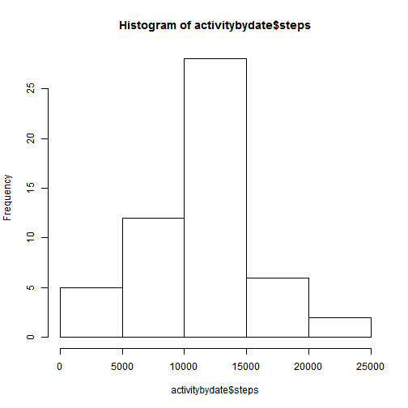
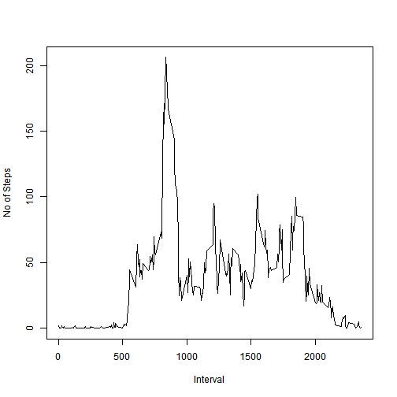
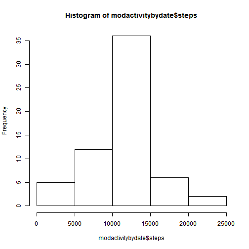
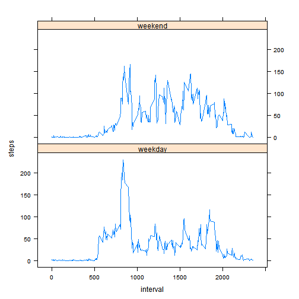

Reproducible Research: Peer Assessment 1
Loading the data
------------------
Skip all the rows that have NA 

```r
setwd("C:/work/reprodres/repdata-data-activity")
activitydata <- read.csv("activity.csv", colClasses = c("numeric", "Date", "numeric"))
Rawactivitydata <- activitydata
activitydata <- na.omit(activitydata)
head(activitydata)
```

```
##     steps       date interval
## 289     0 2012-10-02        0
## 290     0 2012-10-02        5
## 291     0 2012-10-02       10
## 292     0 2012-10-02       15
## 293     0 2012-10-02       20
## 294     0 2012-10-02       25
```

What is mean total number of steps taken per day?
-------------------------------------------------

Make a histogram of the total number of steps taken each day
Calculate and report the **mean** and **median** total number of steps taken 
per day 


```r

activitybydate <- aggregate(steps ~ date, data = activitydata, sum)
hist(activitybydate$steps)
```

 

```r
mean(activitybydate$steps)
```

```
## [1] 10766
```

```r
median(activitybydate$steps)
```

```
## [1] 10765
```

What is the average daily activity pattern?
-------------------------------------------

* Make a time series plot (i.e. type = "l") of the 5-minute interval (x-axis) and the average number of steps taken, averaged across all days (y-axis)


```r
activitybyint <- aggregate(steps ~ interval, data = activitydata, mean)
plot(activitybyint$interval, activitybyint$steps, xlab = "Interval", ylab = "No of Steps", 
    type = "l")
```

 


Which 5-minute interval, on average across all the days in the dataset, contains the maximum number of steps? 


```r
which.max(activitybyint$steps)
```

```
## [1] 104
```

```r
activitybyint[which.max(activitybyint$steps), ]$interval
```

```
## [1] 835
```

Imputing missing values
-----------------------

* Calculate and report the total number of missing values in the dataset (i.e. the total number of rows with NAs


```r
sum(is.na(Rawactivitydata$steps))
```

```
## [1] 2304
```

* Devise a strategy for filling in all of the missing values in the dataset. The strategy does not need to be sophisticated. For example, you could use the mean/median for that day, or the mean for that 5-minute interval, etc.
I am using the average no of steps as computed above to replace

```r
totalrows <- nrow(Rawactivitydata)
modactivitydata <- Rawactivitydata
for (i in 1:totalrows) {
    if (is.na(Rawactivitydata$steps[i])) {
        modactivitydata$steps[i] <- activitybyint[activitybyint$interval == 
            Rawactivitydata$interval[i], ]$steps
    }
}
summary(Rawactivitydata)
```

```
##      steps            date               interval   
##  Min.   :  0.0   Min.   :2012-10-01   Min.   :   0  
##  1st Qu.:  0.0   1st Qu.:2012-10-16   1st Qu.: 589  
##  Median :  0.0   Median :2012-10-31   Median :1178  
##  Mean   : 37.4   Mean   :2012-10-31   Mean   :1178  
##  3rd Qu.: 12.0   3rd Qu.:2012-11-15   3rd Qu.:1766  
##  Max.   :806.0   Max.   :2012-11-30   Max.   :2355  
##  NA's   :2304
```

```r
summary(modactivitydata)
```

```
##      steps            date               interval   
##  Min.   :  0.0   Min.   :2012-10-01   Min.   :   0  
##  1st Qu.:  0.0   1st Qu.:2012-10-16   1st Qu.: 589  
##  Median :  0.0   Median :2012-10-31   Median :1178  
##  Mean   : 37.4   Mean   :2012-10-31   Mean   :1178  
##  3rd Qu.: 27.0   3rd Qu.:2012-11-15   3rd Qu.:1766  
##  Max.   :806.0   Max.   :2012-11-30   Max.   :2355
```


Make a histogram of the total number of steps taken each day and Calculate
and report the mean and median total number of steps taken per day.Do
these values differ from the estimates from the first part of the assignment


```r
modactivitybydate <- aggregate(steps ~ date, data = modactivitydata, sum)
hist(modactivitybydate$steps)
```

 

```r
mean(modactivitybydate$steps)
```

```
## [1] 10766
```

```r
median(modactivitybydate$steps)
```

```
## [1] 10766
```


Are there differences in activity patterns between weekdays and weekends?
1. Create a new factor variable in the dataset with two levels - "weekday"
and "weekend" indicating whether a given date is a weekday or weekend
day.
2. Make a panel plot containing a time series plot (i.e. type = "l") of the
5-minute interval (x-axis) and the average number of steps taken, averaged
across all weekday days or weekend days (y-axis)Are there differences in activity patterns between weekdays and weekends?

```r
modactivitydata$day <- ifelse(as.POSIXlt(as.Date(modactivitydata$date))$wday%%6 == 
    0, "weekend", "weekday")
modactivitydata$day = factor(modactivitydata$day, levels = c("weekday", "weekend"))
modactivitysummary <- aggregate(steps ~ interval + day, data = modactivitydata, 
    mean)
library(lattice)
```

```
## Warning: package 'lattice' was built under R version 3.0.3
```

```r
xyplot(steps ~ interval | factor(day), data = modactivitysummary, aspect = 1/2, 
    type = "l")
```

 

